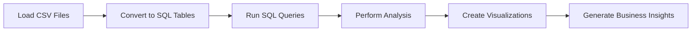

# Bike-Store-SQL-Analytics
#  Bike Store SQL Analytics Project

##  Project Summary

This project is a **complete data analysis case study** built using the Bike Store dataset, designed to simulate a real-world retail analytics environment.

Using **SQL and Python**, this project transforms raw transactional data into **meaningful business insights** by analyzing sales performance, customer behavior, and inventory management.

It demonstrates how data analysts use **relational databases + SQL queries + visualizations** to support business decision-making.

---

##  Business Problem

Retail businesses need answers to questions like:

* Which store is generating the highest revenue?
* Who are the most valuable customers?
* Which products are driving sales?
* Are there inventory shortages affecting sales?

This project answers these questions using **data-driven analysis**.

---

##  Key Skills Demonstrated

✔ SQL (Joins, Aggregations, Group By, Subqueries)
✔ Data Analysis using Python (pandas)
✔ Relational Database Handling (SQLite)
✔ Business Insight Generation
✔ Data Visualization (Matplotlib & Seaborn)

---

##  Dataset Overview

The dataset represents a **retail bike store system** with multiple interconnected tables:

| Table       | Description              |
| ----------- | ------------------------ |
| customers   | Customer information     |
| orders      | Order transactions       |
| order_items | Product-level sales data |
| products    | Product catalog          |
| brands      | Product brands           |
| categories  | Product categories       |
| stores      | Store locations          |
| staffs      | Employees                |
| stocks      | Inventory levels         |

 This relational structure allows advanced SQL operations like joins and aggregations.

---

##  Workflow



---

##  Analysis Breakdown

###  1. Data Preparation

* Loaded CSV files using pandas
* Converted data into SQLite database
* Structured tables for SQL querying

---

###  2. SQL Exploration

* Basic queries (`SELECT`, `WHERE`, `ORDER BY`)
* Data validation and structure understanding

---

###  3. JOIN Analysis

* Combined multiple tables to create meaningful datasets
* Example: linking orders → customers → stores

---

###  4. Aggregations

* Customer distribution by region
* Product counts by category and brand
* Stock availability across stores

---

###  5. Sales Analysis

Revenue calculated using:

```sql
Revenue = quantity × list_price × (1 - discount)
```

Key insights generated:

* Revenue by store
* Revenue by category
* Revenue by brand
* Monthly sales trends

---

###  6. Customer Analysis

* Identified **top 10 customers by spending**
* Analyzed customer contribution to revenue

---

###  7. Inventory Analysis

* Evaluated stock distribution
* Identified **low-stock products**
* Highlighted potential supply issues

---

##  Visualizations

The project includes multiple visual insights:

* 📈 Monthly Revenue Trend
* 🏬 Revenue by Store
* 🛍️ Revenue by Category
* 🏷️ Revenue by Brand
* 👥 Top Customers by Spending
* 📦 Stock Distribution

---

##  Key Business Insights

* 🏆 Certain stores dominate revenue generation
* 🛍️ A few product categories contribute most to sales
* 💰 Revenue is driven by a small group of high-value customers
* 📉 Some products face low inventory, risking lost sales
* 📊 Sales show clear time-based trends

---

##  Project Structure

```
📦 Bike-Store-SQL-Analytics
 ┣ 📜 Bike_Store_SQL_Analysis.ipynb
 ┣ 📜 README.md
 ┗ 📂 Dataset Source:-https://www.kaggle.com/datasets/dillonmyrick/bike-store-sample-database
    Dataset can be also seen through: https://github.com/mukul816/Bike-Store-SQL-Analytics/tree/main/Datasets
```

---

##  How to Run

1. Download dataset from Kaggle
2. Open Jupyter Notebook
3. Update dataset path if required
4. Run all cells sequentially

---

##  Future Enhancements

* 📊 Build Power BI / Tableau dashboard
* 🤖 Add predictive modeling (sales forecasting)
* ⚡ Optimize SQL queries for large datasets
* 🌐 Deploy as a web-based analytics dashboard

---

## 🤝 Connect with Me

* 💼 LinkedIn: www.linkedin.com/in/mukul-girdhar-560333357
* 💻 GitHub: https://github.com/mukul816

---


## Author

Mukul 
